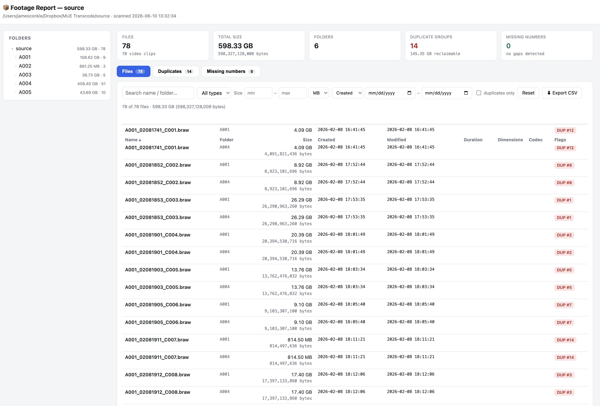

# Footage Indexer

A zero-install, read-only folder indexer for macOS, built for video workflows. Double-click it, pick a folder, and get an interactive HTML report of everything inside: exact sizes down to the byte, creation and modification dates, clip duration, resolution, and codec — plus two things Finder can't tell you:

- **Exact duplicates** — clips that were copied over twice, even if they were renamed, found by full SHA-256 checksum.
- **Missing clips** — numbered sequences with gaps. If a folder has `A001_C001`, `C002`, and `C004`, it tells you `A001_C003.MP4` is missing.



## Usage

1. Download `Footage Indexer.command`.
2. Double-click it. (First time: right-click → **Open** to get past Gatekeeper.)
3. Pick the folder to index.
4. A Terminal window shows scan progress; when done, the report opens in your browser and is saved to your Desktop.

Terminal users can pass a path directly:

```bash
./Footage\ Indexer.command /Volumes/SSD/ProjectX/Footage
```

## The report

| Section | What it shows |
|---|---|
| **Summary cards** | File count, total size (human-readable + exact bytes), total footage runtime, duplicate groups with reclaimable space, missing-number count |
| **Folder tree** | Every folder with rolled-up size and file count; click a folder to scope the table to it |
| **Files table** | Name, folder, size (exact bytes shown under each), created, modified, duration, dimensions, codec, duplicate flags — sortable by any column |
| **Duplicates tab** | Groups of byte-identical files with all copies listed, their dates, and how much space the extras waste |
| **Missing numbers tab** | Each gapped sequence with its pattern (`A001_C###.MP4`), the range present, every missing number, and an example expected filename |

Filters: name/folder search, file type, size range, date range (created or modified), duplicates-only. The filtered view can be exported to CSV.

The report is a single self-contained HTML file — it works offline and can be archived or shared with a project.

## How it works

**Duplicate detection.** Two files can only be identical if they're the same size, so the indexer first groups files by exact byte size, then computes a full SHA-256 checksum of every size-matched candidate. The result is identical to checksumming the entire library, but terabytes of unique footage are skipped instead of read. Files flagged as duplicates are byte-for-byte identical — renames and different folders don't hide them. Nothing is deleted; the report only shows you what's there.

**Missing-clip detection.** Within each folder, filenames are grouped by the text around the last number in the name (so `A001_C002.MP4` groups as `A001_C###.MP4`). Any number absent between the lowest and highest found is reported. A density heuristic suppresses false positives from timestamp-style names like `IMG_20260601.jpg`.

**Video metadata.** Duration, resolution, and codec are parsed directly from MP4/MOV/M4V container headers in pure Python — no ffmpeg, no Homebrew — so it works on external and network drives where Spotlight hasn't indexed. Other formats (MXF, AVI, MKV…) fall back to Spotlight metadata (`mdls`) where available.

**Dates.** Creation dates come from the filesystem's true birth time (`st_birthtime`). On the rare volume that doesn't store one, the report marks those files with an asterisk.

## Read-only 

Against the folder you scan, the tool only lists directories, reads file metadata, and opens files for reading. It contains no code path that writes, renames, moves, or deletes anything inside the scanned folder. Its only output is the HTML report written to your Desktop. (As with any program that reads files, the OS may update last-*accessed* timestamps; created/modified dates are never touched.)

## Requirements

- macOS 
- Python 3 

## Notes and limitations

- Hidden files (dotfiles like `.DS_Store`) and symlinks are skipped; skipped/unreadable items are listed at the bottom of the report.
- Full checksumming reads every byte of size-matched candidates, so a library with many same-sized files takes longer on slow drives. Progress and read speed are shown live.
- Duplicate detection is *exact*: a re-encoded or trimmed copy of a clip is a different file and won't be flagged.
- Sizes use decimal units (1 GB = 1,000,000,000 bytes) to match Finder; exact byte counts are always shown alongside.
- The report embeds the full index, so a scan of hundreds of thousands of files produces a large HTML file; the table renders in chunks to stay responsive.


## License

MIT.
